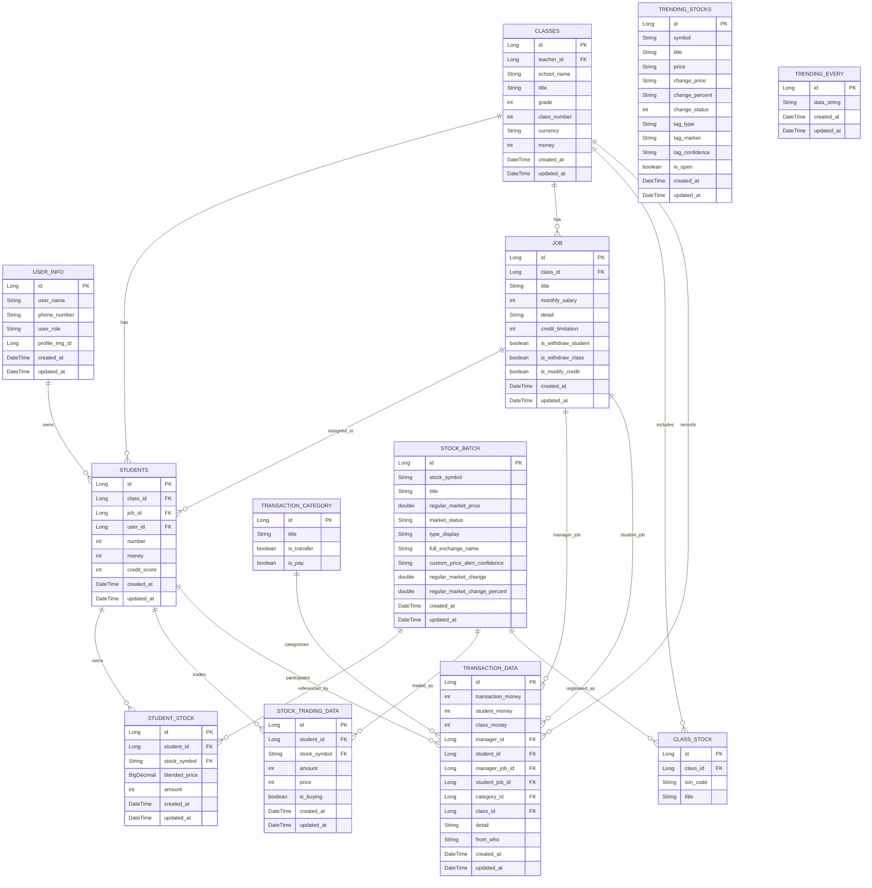
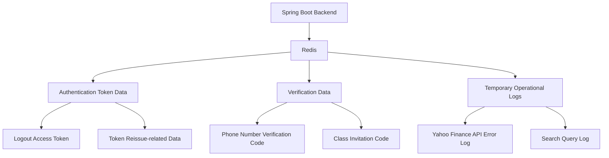

# M-Class Backend
 

## Overview
M-Class Backend is the Spring Boot server for a fintech education app that helps teenagers experience simulated banking and stock investment in a classroom environment.
  
## Tech Stack
!Java
!Spring Boot
!MySQL
!Redis
!Yahoo Finance
  

## Main Features
 
### 1. Classroom Financial Education
- Manage classroom information such as school name, grade, class number, class currency, and class fund
- Manage students within each class
- Assign jobs to students
- Manage job-based salary, credit limits, and permission settings
- Register tradable stocks for each class

Related tables: `class`, `students`, `job`, `class_stock`
 
### 2. Student Money & Transaction Management

- Track each student's simulated money balance and credit score
- Record class/student balance snapshots after transactions
- Store transaction details, participants, job information, and categories
- Distinguish transfer/payment transactions through transaction categories

Related tables: `students`, `transaction_data`, `transaction_category`, `job`
 
### 3. Stock Market Data

- Store stock symbol, title, current price, market status, exchange name, and price movement
- Store regular market change and change percentage
- Manage trending stock data for frontend display
- Provide stock-related data to React WebView screens

Related tables: `stock_batch`, `trending_stocks`, `trending_every`
 
### 4. Simulated Stock Trading

- Store student stock holdings
- Track average purchase price and quantity
- Record simulated buy/sell trading history
- Connect student holdings with stock market data
- Support buy/sell flows in the React WebView

Related tables: `student_stock`, `stock_trading_data`, `stock_batch`, `class_stock`
 
### 5. User & Role Data

- Store basic user profile information
- Manage user role information
- Connect users with student records and classroom activities

Related tables: `user_info`, `students`, `class`
  

### Architecture

  
### Database Design
The original JPA entities used ID-based references such as `classId`, `studentId`, `jobId`, and `stockSymbol` instead of explicit `@ManyToOne` / `@OneToMany` mappings.  
The ERD below represents logical relationships inferred from these reference columns.
 

  

## API Overview

This section summarises the main REST APIs implemented in the backend.  
The APIs were grouped by product domain: authentication, classroom management, student/job management, banking transactions, stock trading, stock detail data, and user profile data.
 
> Note: The backend used a custom response wrapper, `BanklassResponseEntity`, and Swagger annotations for documenting response cases and domain-specific error codes.
 
---
 
### Authentication

| Method | Endpoint | Description |
|---|---|---|
| POST | `/api/auth/start-signin` | Sign in and return initial user/class information |
| POST | `/api/auth/start-signup` | Sign up and automatically sign in |
| POST | `/api/auth/logout` | Log out and store invalidated access token in Redis |
| POST | `/api/auth/reissue` | Reissue access token using refresh token |
| POST | `/api/auth/sendSMS` | Send phone verification code |
| GET | `/api/auth/{user_id}/get-token` | Issue access token for WebView access |
 
--- 
 
### Classroom Management
 
| Method | Endpoint | Description |
|---|---|---|
| POST | `/api/class/create` | Create a new class |
| GET | `/api/class/{class_id}/account` | Get class account information, including class fund and currency |
| GET | `/api/class/{class_id}/change` | Get class fund change compared to the previous transaction |
| GET | `/api/class/{class_id}/currency` | Get class currency unit |
| GET | `/api/class/{class_id}/invitation-code` | Get or issue class invitation code |
| GET | `/api/class/check/invitation-code` | Validate class invitation code |
| GET | `/api/class/enter-class/{class_id}` | Enter a class and return the student ID used in that class |
 
---
 
### Student & Job Management
 
| Method | Endpoint | Description |
|---|---|---|
| GET | `/api/class/{class_id}/job/all` | Get all common and class-specific jobs |
| GET | `/api/class/{class_id}/student/job/all` | Get job status of all students in a class |
| GET | `/api/class/{class_id}/student-selector` | Get student selector list for transfer/payment flows |
| GET | `/api/job/{job_id}` | Get job detail information |
| POST | `/api/job/create` | Create a new job |
| PUT | `/api/job/update` | Update one student's job |
| PUT | `/api/job/update/all` | Update jobs for multiple students |
| DELETE | `/api/job/{job_id}/delete` | Delete a job |
| POST | `/api/student/join-class` | Join a class using invitation information |
| GET | `/api/student/{student_id}/account` | Get student account information |
| GET | `/api/student/{student_id}/job` | Get student job card information |
| GET | `/api/student/{student_id}/change` | Get student balance change compared to the previous transaction |
| GET | `/api/student/salary/{student_id}` | Get salary amount based on student job |
 
---
 
### Banking & Transactions
 
| Method | Endpoint | Description |
|---|---|---|
| GET | `/api/transaction/student/{student_id}` | Get student transaction history with type filter and pagination |
| GET | `/api/transaction/class/{class_id}` | Get class account transaction history with type filter and pagination |
| GET | `/api/transaction/category` | Get transaction category selector list |
| POST | `/api/transaction/transfer` | Transfer money from student account to class account |
| POST | `/api/transaction/pay` | Pay money from class account to student account |
| GET | `/api/transaction/student/detail/{transaction_id}` | Get transaction detail from student account perspective |
| GET | `/api/transaction/class/detail/{transaction_id}` | Get transaction detail from class account perspective |
 
---
 
### Stock Portfolio & Trading
 
| Method | Endpoint | Description |
|---|---|---|
| GET | `/api/stock/total-info/{student_id}` | Get student's total stock portfolio summary |
| GET | `/api/stock/{student_id}` | Get student's owned stock list with pagination |
| GET | `/api/stock/trending` | Get today's trending stock list |
| GET | `/api/stock/search-stocks` | Get stock search autocomplete result |
| GET | `/api/stock/search-stocks-list` | Get stored search autocomplete list |
| GET | `/api/stock/news/market` | Get market news |
| GET | `/api/stock/check-buying` | Check stock price and required information before buying |
| POST | `/api/stock/buy` | Create simulated stock buy order |
| GET | `/api/stock/check-selling` | Check sellable amount and current price before selling |
| POST | `/api/stock/sell` | Create simulated stock sell order |
 
---
 
### Stock Detail Data
 
| Method | Endpoint | Description |
|---|---|---|
| GET | `/api/stock-detail/{stock_id}` | Get stock detail information |
| GET | `/api/stock-detail/{stock_id}/similar` | Get similar stock list |
| GET | `/api/stock-detail/{stock_id}/news` | Get stock-related news |
| GET | `/api/stock-detail/{stock_id}/recommend-trend` | Get recommendation trend graph data |
| GET | `/api/stock-detail/{stock_id}/chart` | Get chart data by range |
| GET | `/api/stock-detail/{stock_id}/company-info` | Get listed company information |
| GET | `/api/stock-detail/{stock_id}/stock-info` | Get stock summary information |
| GET | `/api/stock-detail/watch-list` | Get most watched / ranked stock list |
 
---
 
### User Profile
 
| Method | Endpoint | Description |
|---|---|---|
| GET | `/api/user/profile-img-list` | Get available profile image list |
| GET | `/api/user/{user_id}/header-info` | Get user name and profile image for header UI |
| GET | `/api/user/{user_id}/student/join-class-list` | Get all classes joined by the user as a student |
 
## Redis Usage
 
Redis was used to manage short-lived and temporary data that did not need to be stored permanently in MySQL. 

The project used Redis for authentication-related token handling, phone verification codes, class invitation codes, Yahoo Finance API error logs, and search query logs. 
 
| Redis Repository | Purpose | Data Type |
|---|---|---|
| `LogoutAccessTokenRedisRepository` | Stores logged-out access tokens to prevent reused tokens after logout | Authentication / token blacklist |
| `PhoneNumberCodeRedisRepository` | Stores temporary phone verification codes during sign-up | SMS verification |
| `ClassInvitationCodeRedisRepository` | Stores invitation codes used when inviting students to a class | Class invitation |
| `YhFinanceErrorLogRedisRepository` | Stores Yahoo Finance API error logs for temporary tracking/debugging | External API error log |
| `SearchQueryLogRedisRepository` | Stores search query logs for later inspection | Search / query log |
 

  
## External API Integration

Yahoo Finance API was integrated to provide stock-related data for the investment education flow. 

The backend retrieved and processed data such as: 

- Current stock price
- Chart data
- Stock news
- Company information
- Related stock data
- Ranking data
 
The processed data was then provided to the React WebView through backend REST APIs.
  
## Current Project Status
This backend was originally built as part of an internship project and was not publicly deployed. Some environment-specific configuration, database setup, or API credentials may need to be restored before running the full application locally.
  

## Future Improvements

- Add Docker Compose for easier MySQL and Redis setup
- Add seed data for local demo mode
- Add unit and integration tests for core APIs
- Refactor ID-based entity references into explicit JPA relationships where appropriate
- Separate external stock data provider logic to make Yahoo Finance API replaceable
- Improve error handling and validation for simulated trading APIs
